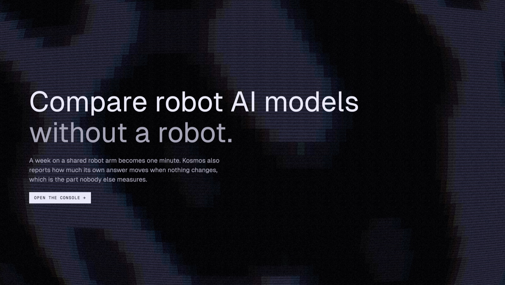
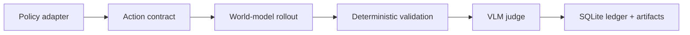
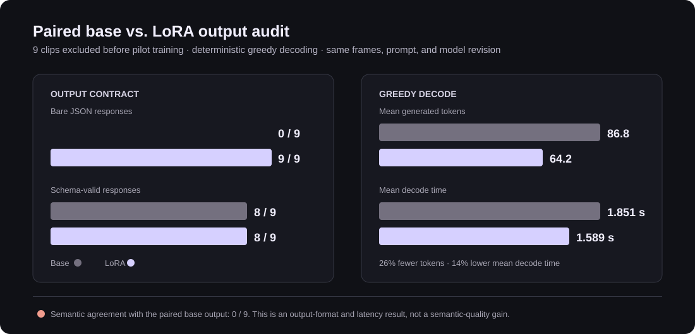

# Kosmos

**Auditable infrastructure for evaluating robot policies through learned world models.**

Kosmos separates the pieces that are often conflated in robot-policy evaluation:
the policy that proposes actions, the world model that predicts a rollout, the
checks that validate artifacts, and the VLM that judges the saved result. Every
run is persisted in a SQLite ledger with inputs, artifacts, timing, and failure
state instead of turning a generated video into an untraceable score.



## What is here



| Area | Implementation |
| --- | --- |
| Control plane | FastAPI, SQLite, idempotent runs, leases, cancellation, immutable attempt artifacts, and event streaming. |
| Policy boundary | Adapters and contract checks for OpenVLA, Octo, MiniVLA, OpenPiZero, SuSIE, and SuSIE_LL. |
| World-model boundary | Cosmos and IRASim adapters with explicit frame/action contracts and hash-bound media. |
| Evaluation | Structured VLM judgments, multi-sample quorum logic, artifact preservation, and calibration tooling. |
| Frontend | React/Vite console for generated rollouts, persisted results, and debugging provenance. |
| Deployment design | A Baseten Chains topology with isolated policy, world-model, validation, and judge stages. It is deployment code, not a claim of a production deployment. |

## Measured post-training audit

The checked-in LoRA pilot improved output formatting and greedy decode cost on
nine clips that were excluded before pilot training. It did **not** establish a
semantic-quality improvement: the adapter changed the integrity judgment on all
eight parseable paired outputs. The graph is useful because it separates an
engineering gain from an evaluation-quality claim.



| Paired audit metric | Base Qwen2.5-VL-7B | LoRA adapter |
| --- | ---: | ---: |
| Schema-valid output | 8 / 9 | 8 / 9 |
| Bare JSON output | 0 / 9 | 9 / 9 |
| Mean generated tokens | 86.8 | 64.2 |
| Mean greedy decode time | 1.851 s | 1.589 s |

Read [the evaluation record](docs/EVALUATION.md) for the audit design, raw
limitations, and the next valid experiment.

## Run locally

Kosmos runs locally without model weights. The console is available with
synthetic and saved-artifact paths; GPU-backed adapters remain unavailable until
their model/runtime configuration is supplied.

```bash
python3 -m venv .venv
.venv/bin/python -m pip install --upgrade pip
.venv/bin/python -m pip install -e '.[test,analytics]'
npm --prefix web install
npm --prefix web run build
.venv/bin/plumb serve --port 8787
```

Open <http://127.0.0.1:8787>. The API reference is at
<http://127.0.0.1:8787/docs>.

```bash
.venv/bin/python -m pytest -q
npm --prefix web run test
```

## Documentation

- [Architecture](docs/ARCHITECTURE.md) — component boundaries and data flow.
- [Evaluation](docs/EVALUATION.md) — what the current experiments measured and what they did not.
- [Reproducibility](docs/REPRODUCIBILITY.md) — local setup, tests, and cluster conventions.
- [Baseten topology](deploy/baseten/README.md) — the typed Chain design and deployment status.

## Status

Kosmos is an engineering and evaluation-research repository. A generated
rollout, an adapter smoke test, or a lower teacher-label loss is not treated as
evidence of robot-task success. Policy ranking requires a frozen protocol and
independently labeled evaluation data.
